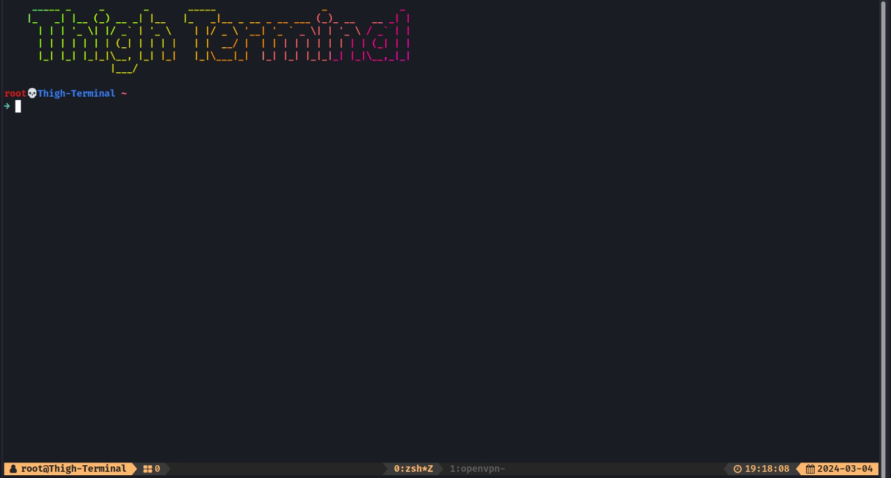
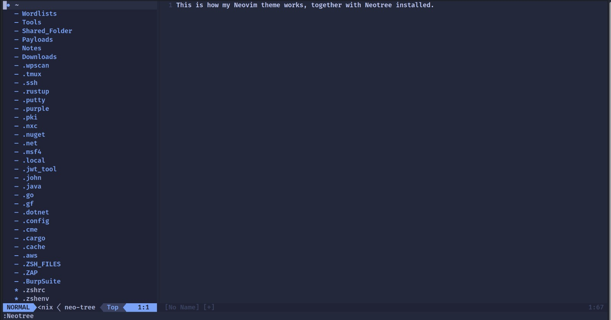
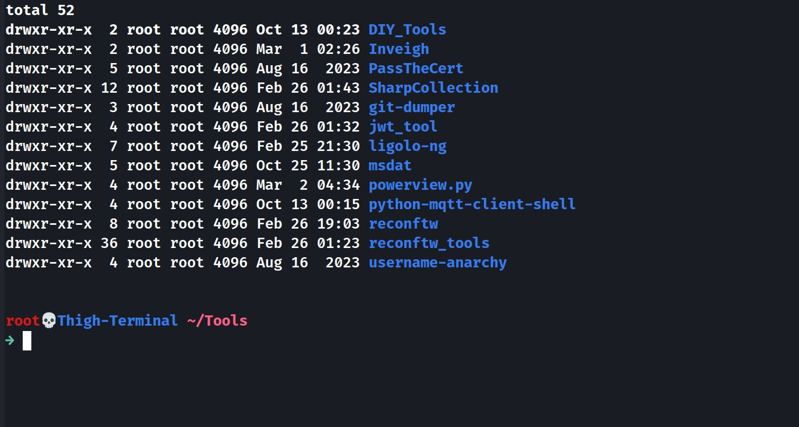
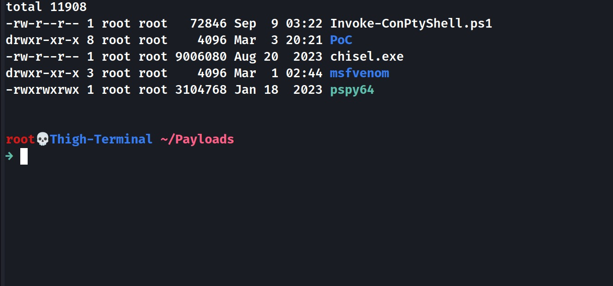
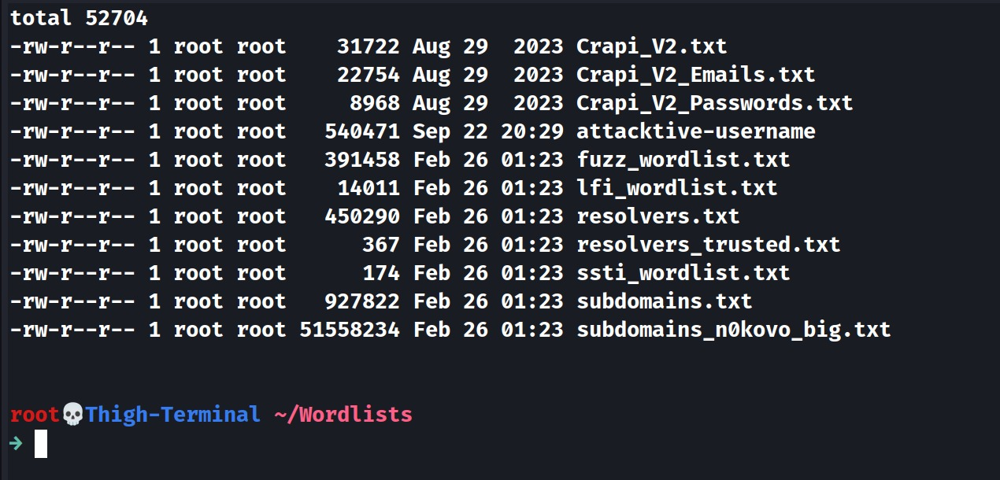
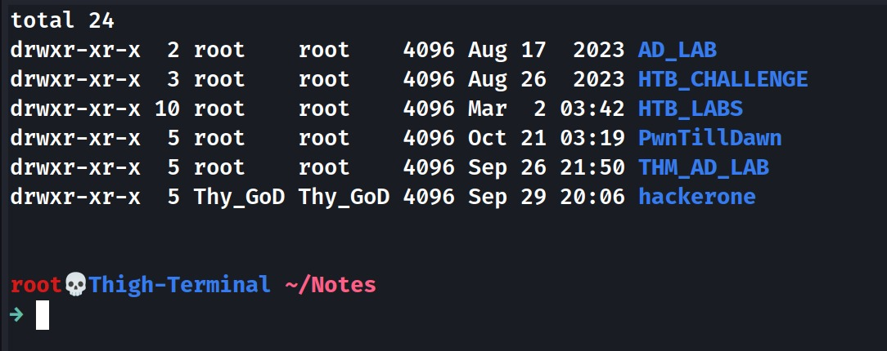

# Thigh_Terminal / Thy_GoD_Docker

Is a Personal Docker Image  with Pentest tools and zsh plugins, inspired by Nutek-Terminal and runs on a base Kali Image.

There's also **auto-complete** and **auto-syntax-highlighting** on zsh, with a "cls" `clear && ls -a` alias.

Feel free to use this to make your own docker projects or whatever. 

(report bugs)

## Images & Showcase (Yay I finally added them)

Main interface + my personal Tmux theme.

How the home directory looks like by default.

This is how my Neovim configuration looks like, with NeoTree as a bonus.

These are the current default tools I have under the Tools directory.
I will eventually plan on adding a Tools list but some Tools may not appear in this directory.

These are the default payloads, msfvenom is for msfvenom-generated payloads.

The wordlist directory is empty by default by [Reconftw](https://github.com/six2dez/reconftw) adds them.

Lastly this is an example of how the Notes directory looks like, I recommend adding subdirectories for organization.

## How to use:

I've made it quite easy, simply run the tools.sh file, **(as root if any conflicts occur somehow.)**.
 
This obviously requires docker installed.

I also recommend running the `docker` argument of my script (see `--help` for more info.), to automatically add your user into the docker group.

The script will then start to build the docker image, once it's done it'll put you inside the container.

You can make this container as a *terminal* by creating a shortcut that runs the tools.sh file.

tools.sh automatically starts the container, enters a running container, and stops the docker container when the "exit" command is used.

It is possible to use a terminal's split-view feature to split the docker terminal window, but honestly it's best to just use tmux.

I have added a custom tmux configuration that uses Ctrl + A as the entry command.

FYI, run `xhost +local:$(id -nu)` to allow your container to use the host's display.

Note that this is automatically done in the tools script, but I have not tested if it works all the time. (You may have to install xhost too.)

With Bloodhound's new updated push to using a Dockerized system instead, I've opted to pre-configure  
a docker-compose.yml file from their directory, to work in conjunction with this container.

Therefore, all you have to do is just run `docker-compose up` (`docker-compose down -v` to remove the containers.)
in the new `/Bloodhound` directory.

Sharphound will still be available within the container itself.

This is subject to change as Bloodhound Community Edition is still being developed and it's new.

Do take note that Bloodhound's web interface's port is on port 1234, so make sure it's available.

## Note: 

I will occasionally make changes to the container in order to optimize, add, edit features or fix bugs.

Please give the dockerfile and Tools.sh a read as there is alot of customization/notifications.

## TODO List:

Add more features and constant bug fixes/updates to functionality.  
Add images and screenshots to make people actually want to use this lmao.   (WIP)
Add a Tools list so you guys won't have to read the dockerfile just to figure out what's installed.
Somehow find a way to magically make IPV6 DNS Takeover Attacks work.  

**Update on IPv6**:

Good news! Turns out I wasn't crazy and the main problem was that docker by nature does not forward 
multicast traffic, what does this mean? LLMNR and DHCPv6 rely on multicast, hence they don't work.
My solution was found when I stumbled upon a github issue thread on moby (docker networking) 
that explained a way to use smcroute to forward multicast traffic to the docker0 interface.

Lo and Behold! IT WORKS! Well, problem is that you'd have to run the commands as root.
Now due to security concerns, I'd recommend checking the Tools script out first, but if you trust me, 
run the tools script with a `autoroute` argument, like `sudo bash Tools.sh autoroute`.

FYI, you also have to change the spoofer ip(ipv6) to your host's so that it gets forwarded to the container.

My endgame is to have a docker container that is so useful to the point where I could run it on any linux distro 
while maintaining all my configurations and tools for pentesting. (It's also more of a challenge than an actual tool)

-Thigh GoD

P.S Here's my [medium article](https://medium.com/@Thigh_GoD/running-responder-mitm6-inside-a-docker-container-without-host-networking-3460998a724a) I wrote about it.
